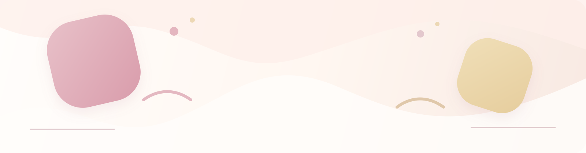

  

  <h1>Hi, I'm 素茉penny 🌷</h1>

  
<strong>把灵感做成柔软、好用的小工具。</strong>

  

  
China · UTC+8

  

---

### 🍰 关于我 · About me

我喜欢把复杂的事情拆成清晰、好用又有一点可爱的界面。

目前主要折腾 TypeScript、Vue、Dart/Flutter，以及各种让日常工作变轻松的小工具。

### 🍬 最近在做 · Now

- 把无限暖暖相关工具整理成更顺手的体验。
- 练习用更轻的交互和更柔和的配色表达复杂信息。
- 持续记录那些值得被复用的小想法。

### 🎀 技术栈 · Toolkit

        

### 🧁 精选项目 · Selected projects

<table>
<tr>
<td width="50%" valign="top">

<h3><a href="https://github.com/sumopenny/Infinity-Nikki-Album-Manager">Infinity-Nikki-Album-Manager</a></h3>

无限暖暖相册管理工具，提供网站直达与整理体验。

<code>TypeScript</code> · <a href="https://infinity-nikki-album-manager.pages.dev/">Live demo ↗</a>

</td>
<td width="50%" valign="top">

<h3><a href="https://github.com/sumopenny/momoinst">momoinst</a></h3>

Vue 项目（简介待补充）。

<code>Vue</code> · <a href="https://momoinst.vercel.app">Live demo ↗</a>

</td>
</tr>
</table>

### 🐍 Contributions, but make it soft

  <picture>
    <source media="(prefers-color-scheme: dark)" srcset="https://raw.githubusercontent.com/sumopenny/sumopenny/output/github-contribution-grid-snake-dark.svg" />
    <source media="(prefers-color-scheme: light)" srcset="https://raw.githubusercontent.com/sumopenny/sumopenny/output/github-contribution-grid-snake.svg" />
    
  </picture>

  正在把想法做成可以被使用的小工具 ✨
   
  made with soft colors, small experiments, and a lot of curiosity · 轻轻做事，慢慢变好

